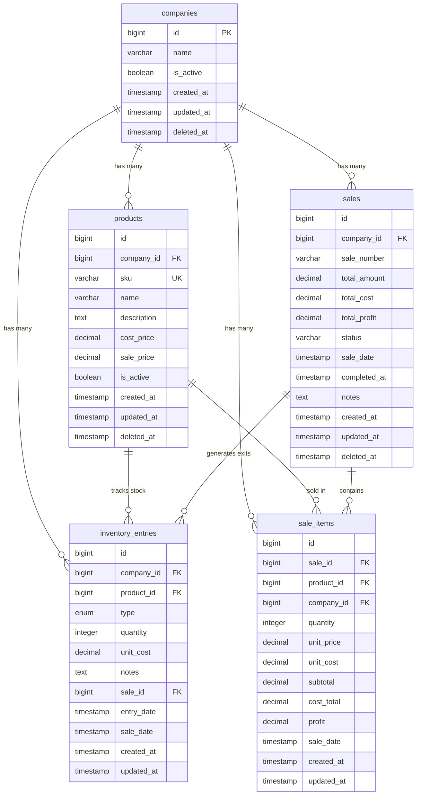

# Database Design Documentation

## Table of Contents
- [Database Selection](#database-selection)
- [Table Structure](#table-structure)
- [Relationships](#relationships)
- [Indexes](#indexes)
- [Constraints](#constraints)
- [Entity-Relationship Diagram](#entity-relationship-diagram)

## Database Selection

### Database System: PostgreSQL 18.0+ with Citus Extension

#### Justification

PostgreSQL with Citus was chosen for this inventory management system for the following strategic reasons:

1. **Horizontal Scalability via Sharding**
   - Citus enables distributed tables across multiple nodes
   - Company-based sharding ensures data locality and improved query performance
   - Critical for multi-tenant architecture where each company's data can grow independently

2. **Advanced Partitioning Support**
   - Native support for table partitioning by date ranges
   - Sales and sale_items tables are partitioned by `sale_date` for optimal time-series query performance
   - Automatic partition management for monthly data segments

3. **ACID Compliance**
   - Strong transactional guarantees essential for inventory and financial data
   - Ensures data consistency across sale creation and inventory updates

4. **Rich Data Types and Constraints**
   - Native support for DECIMAL types for precise financial calculations
   - CHECK constraints for business rule enforcement at the database level
   - ENUM-like constraints for status fields

5. **Performance Features**
   - Sophisticated query optimizer for complex joins and aggregations
   - Partial indexes for soft-delete patterns
   - Composite indexes for multi-column queries

## Table Structure

### 1. companies

**Purpose**: Central tenant table for multi-tenancy support. All other tables reference this for data isolation.

| Column | Type | Nullable | Default | Description |
|--------|------|----------|---------|-------------|
| id | BIGSERIAL | NO | AUTO | Primary key |
| name | VARCHAR(255) | NO | - | Company name |
| is_active | BOOLEAN | NO | true | Active status flag |
| created_at | TIMESTAMP | YES | - | Record creation timestamp |
| updated_at | TIMESTAMP | YES | - | Last update timestamp |
| deleted_at | TIMESTAMP | YES | NULL | Soft delete timestamp |

**Normalization**: 1NF - All attributes are atomic

### 2. products

**Purpose**: Product catalog with pricing information. Scoped to companies for multi-tenancy.

| Column | Type | Nullable | Default | Description |
|--------|------|----------|---------|-------------|
| id | BIGSERIAL | NO | AUTO | Auto-increment ID |
| company_id | BIGINT | NO | - | Foreign key to companies |
| sku | VARCHAR(255) | NO | - | Stock Keeping Unit (unique per company) |
| name | VARCHAR(255) | NO | - | Product name |
| description | TEXT | YES | NULL | Product description |
| cost_price | DECIMAL(15,2) | NO | - | Purchase/cost price |
| sale_price | DECIMAL(15,2) | NO | - | Selling price |
| is_active | BOOLEAN | NO | true | Active status flag |
| created_at | TIMESTAMP | YES | - | Record creation timestamp |
| updated_at | TIMESTAMP | YES | - | Last update timestamp |
| deleted_at | TIMESTAMP | YES | NULL | Soft delete timestamp |

**Primary Key**: Composite (company_id, id) - Enables efficient sharding

**Normalization**: 2NF - No partial dependencies; all non-key attributes depend on the entire composite key

### 3. sales (Partitioned Table)

**Purpose**: Sales transaction header. Partitioned by sale_date for time-series optimization.

| Column | Type | Nullable | Default | Description |
|--------|------|----------|---------|-------------|
| id | BIGSERIAL | NO | AUTO | Auto-increment ID |
| company_id | BIGINT | NO | - | Foreign key to companies |
| sale_number | VARCHAR(255) | NO | - | Human-readable sale identifier |
| total_amount | DECIMAL(15,2) | NO | 0 | Total sale amount |
| total_cost | DECIMAL(15,2) | NO | 0 | Total cost of goods sold |
| total_profit | DECIMAL(15,2) | NO | 0 | Calculated profit (amount - cost) |
| status | VARCHAR(255) | NO | 'pending' | Sale status (pending/processing/completed/failed) |
| sale_date | TIMESTAMP | NO | CURRENT_TIMESTAMP | Sale transaction date |
| completed_at | TIMESTAMP | YES | NULL | Completion timestamp |
| notes | TEXT | YES | NULL | Additional notes |
| created_at | TIMESTAMP | YES | - | Record creation timestamp |
| updated_at | TIMESTAMP | YES | - | Last update timestamp |
| deleted_at | TIMESTAMP | YES | NULL | Soft delete timestamp |

**Primary Key**: Composite (company_id, id, sale_date) - Required for partitioning

**Partitioning Strategy**: Range partitioning by sale_date (monthly partitions)

**Normalization**: 2NF - Calculated fields (total_profit) are denormalized for performance

### 4. sale_items (Partitioned Table)

**Purpose**: Line items for each sale. Partitioned by sale_date matching parent sales table.

| Column | Type | Nullable | Default | Description |
|--------|------|----------|---------|-------------|
| id | BIGSERIAL | NO | AUTO | Auto-increment ID |
| sale_id | BIGINT | NO | - | Foreign key to sales |
| product_id | BIGINT | NO | - | Foreign key to products |
| company_id | BIGINT | NO | - | Foreign key to companies |
| quantity | INTEGER | NO | - | Quantity sold |
| unit_price | DECIMAL(15,2) | NO | - | Price per unit at time of sale |
| unit_cost | DECIMAL(15,2) | NO | - | Cost per unit at time of sale |
| subtotal | DECIMAL(15,2) | NO | - | Calculated: quantity × unit_price |
| cost_total | DECIMAL(15,2) | NO | - | Calculated: quantity × unit_cost |
| profit | DECIMAL(15,2) | NO | - | Calculated: subtotal - cost_total |
| sale_date | TIMESTAMP | YES | - | Sale date (for partitioning) |
| created_at | TIMESTAMP | YES | - | Record creation timestamp |
| updated_at | TIMESTAMP | YES | - | Last update timestamp |

**Primary Key**: Composite (company_id, id, sale_date) - Required for partitioning

**Partitioning Strategy**: Range partitioning by sale_date (monthly partitions)

**Normalization**: 2NF - Denormalized pricing fields capture historical values

### 5. inventory_entries

**Purpose**: Ledger-style inventory tracking. Each entry represents a stock movement (entry or exit).

| Column | Type | Nullable | Default | Description |
|--------|------|----------|---------|-------------|
| id | BIGSERIAL | NO | AUTO | Auto-increment ID |
| company_id | BIGINT | NO | - | Foreign key to companies |
| product_id | BIGINT | NO | - | Foreign key to products |
| type | ENUM | NO | - | Entry type: 'entry' or 'exit' |
| quantity | INTEGER | NO | - | Quantity (positive for entry, negative for exit) |
| unit_cost | DECIMAL(15,2) | YES | NULL | Cost per unit (for entries) |
| notes | TEXT | YES | NULL | Additional notes |
| sale_id | BIGINT | YES | NULL | Related sale ID (for exits) |
| entry_date | TIMESTAMP | NO | CURRENT_TIMESTAMP | Entry timestamp |
| sale_date | TIMESTAMP | YES | NULL | Sale date (for foreign key to sales) |
| created_at | TIMESTAMP | YES | - | Record creation timestamp |
| updated_at | TIMESTAMP | YES | - | Last update timestamp |

**Primary Key**: Composite (company_id, id) - Enables efficient sharding

**Normalization**: 3NF - No transitive dependencies

## Relationships

### One-to-Many Relationships

1. **companies → products** (1:N)
   - One company has many products
   - Foreign Key: `products.company_id` → `companies.id`
   - Cascade: ON DELETE CASCADE

2. **companies → sales** (1:N)
   - One company has many sales
   - Foreign Key: `sales.company_id` → `companies.id`
   - Cascade: ON DELETE CASCADE

3. **companies → inventory_entries** (1:N)
   - One company has many inventory entries
   - Foreign Key: `inventory_entries.company_id` → `companies.id`
   - Cascade: ON DELETE CASCADE

4. **products → inventory_entries** (1:N)
   - One product has many inventory entries
   - Foreign Key: `(inventory_entries.company_id, inventory_entries.product_id)` → `(products.company_id, products.id)`

5. **products → sale_items** (1:N)
   - One product appears in many sale items
   - Foreign Key: `(sale_items.company_id, sale_items.product_id)` → `(products.company_id, products.id)`

6. **sales → sale_items** (1:N)
   - One sale has many line items
   - Foreign Key: `(sale_items.company_id, sale_items.sale_id, sale_items.sale_date)` → `(sales.company_id, sales.id, sales.sale_date)`

7. **sales → inventory_entries** (1:N)
   - One sale generates many inventory exits
   - Foreign Key: `(inventory_entries.company_id, inventory_entries.sale_id, inventory_entries.sale_date)` → `(sales.company_id, sales.id, sales.sale_date)`

### Relationship Cardinality Summary

```
Company (1) ──< (N) Product
Company (1) ──< (N) Sale
Company (1) ──< (N) InventoryEntry
Product (1) ──< (N) InventoryEntry
Product (1) ──< (N) SaleItem
Sale (1) ──< (N) SaleItem
Sale (1) ──< (N) InventoryEntry
```

## Indexes

### Performance Optimization Strategy

Indexes are strategically placed to optimize:
- Multi-tenant queries (company_id filtering)
- Time-series queries (date range filtering)
- Status-based filtering
- Soft-delete patterns
- Foreign key lookups

### companies Table

| Index Name | Columns | Type | Purpose |
|------------|---------|------|---------|
| PRIMARY | id | B-tree | Primary key lookup |
| idx_companies_is_active | is_active | B-tree | Filter active companies |
| idx_companies_created_at | created_at | B-tree | Chronological queries |

### products Table

| Index Name | Columns | Type | Purpose |
|------------|---------|------|---------|
| PRIMARY | (company_id, id) | B-tree | Composite primary key for sharding |
| idx_products_sku | sku | B-tree | SKU lookups |
| idx_products_company_sku_active | (company_id, sku) WHERE deleted_at IS NULL | Partial Unique | Enforce unique SKU per company (excluding soft-deleted) |
| idx_products_is_active | is_active | B-tree | Filter active products |
| idx_products_company_active | (company_id, is_active) | B-tree | Company-scoped active product queries |
| idx_products_created_at | created_at | B-tree | Chronological queries |

### sales Table

| Index Name | Columns | Type | Purpose |
|------------|---------|------|---------|
| PRIMARY | (company_id, id, sale_date) | B-tree | Composite primary key for partitioning |
| idx_sales_company_status_date_desc | (company_id, status, sale_date DESC) WHERE deleted_at IS NULL | Partial B-tree | Optimized for status-filtered date range queries |

### sale_items Table

| Index Name | Columns | Type | Purpose |
|------------|---------|------|---------|
| PRIMARY | (company_id, id, sale_date) | B-tree | Composite primary key for partitioning |
| sale_items_sale_id_index | sale_id | B-tree | Join with sales table |
| sale_items_product_id_index | product_id | B-tree | Join with products table |
| sale_items_company_id_index | company_id | B-tree | Company-scoped queries |
| sale_items_sale_id_product_id_company_id_sale_date_index | (sale_id, product_id, company_id, sale_date) | B-tree | Composite queries and foreign key |

### inventory_entries Table

| Index Name | Columns | Type | Purpose |
|------------|---------|------|---------|
| PRIMARY | (company_id, id) | B-tree | Composite primary key for sharding |
| idx_inventory_entries_type | type | B-tree | Filter by entry/exit type |
| idx_inventory_entries_company_product | (company_id, product_id) | B-tree | Product inventory queries |
| idx_inventory_entries_product_type | (product_id, type) | B-tree | Stock calculation queries |
| idx_inventory_entries_entry_date | entry_date | B-tree | Time-series queries |
| idx_inventory_entries_company_entry_date | (company_id, entry_date) | B-tree | Company-scoped time-series queries |
| idx_inventory_entries_updated_at | updated_at | B-tree | Stale inventory detection |

## Constraints

### Check Constraints

#### products Table
- `products_cost_price_check`: `cost_price >= 0` - Ensures non-negative cost prices
- `products_sale_price_check`: `sale_price >= 0` - Ensures non-negative sale prices

#### sales Table
- `sales_total_amount_check`: `total_amount >= 0` - Ensures non-negative total amounts
- `sales_total_cost_check`: `total_cost >= 0` - Ensures non-negative total costs
- `sales_status_check`: `status IN ('pending', 'processing', 'completed', 'failed')` - Enforces valid status values

#### sale_items Table
- `sale_items_quantity_check`: `quantity > 0` - Ensures positive quantities
- `sale_items_unit_price_check`: `unit_price >= 0` - Ensures non-negative unit prices
- `sale_items_unit_cost_check`: `unit_cost >= 0` - Ensures non-negative unit costs
- `sale_items_subtotal_check`: `subtotal >= 0` - Ensures non-negative subtotals
- `sale_items_cost_total_check`: `cost_total >= 0` - Ensures non-negative cost totals

#### inventory_entries Table
- `inventory_entries_quantity_check`: `quantity != 0` - Prevents zero-quantity entries

### Foreign Key Constraints

#### products Table
- `products_company_id_foreign`: `company_id` → `companies.id` ON DELETE CASCADE

#### sales Table
- `sales_company_id_foreign`: `company_id` → `companies.id` ON DELETE CASCADE

#### sale_items Table
- `sale_items_company_id_foreign`: `company_id` → `companies.id` ON DELETE CASCADE
- `sale_items_product_id_foreign`: `(company_id, product_id)` → `(products.company_id, products.id)`
- `sale_items_sale_id_foreign`: `(company_id, sale_id, sale_date)` → `(sales.company_id, sales.id, sales.sale_date)`

#### inventory_entries Table
- `inventory_entries_company_id_foreign`: `company_id` → `companies.id` ON DELETE CASCADE
- `inventory_entries_product_id_foreign`: `(company_id, product_id)` → `(products.company_id, products.id)`
- `inventory_entries_sale_id_foreign`: `(company_id, sale_id, sale_date)` → `(sales.company_id, sales.id, sales.sale_date)`

### Unique Constraints

- **products**: Unique index on `(company_id, sku)` WHERE `deleted_at IS NULL` - Ensures SKU uniqueness per company (excluding soft-deleted records)

### Default Values

- **companies.is_active**: `true`
- **products.is_active**: `true`
- **sales.total_amount**: `0`
- **sales.total_cost**: `0`
- **sales.total_profit**: `0`
- **sales.status**: `'pending'`
- **sales.sale_date**: `CURRENT_TIMESTAMP`
- **inventory_entries.entry_date**: `CURRENT_TIMESTAMP`

## Entity-Relationship Diagram



